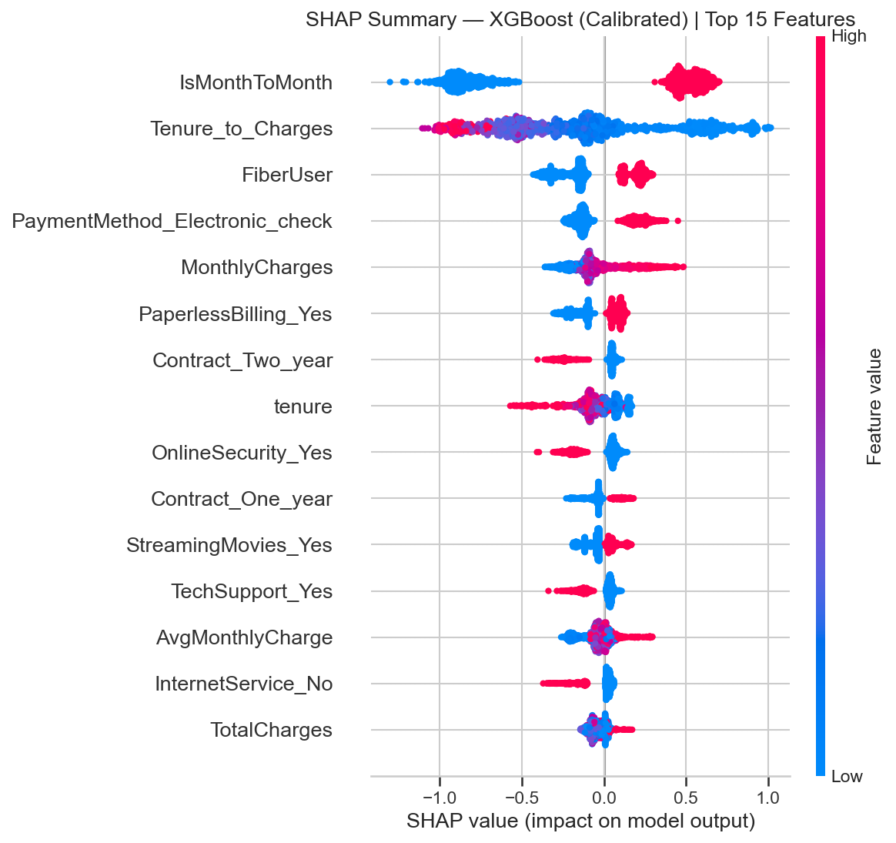
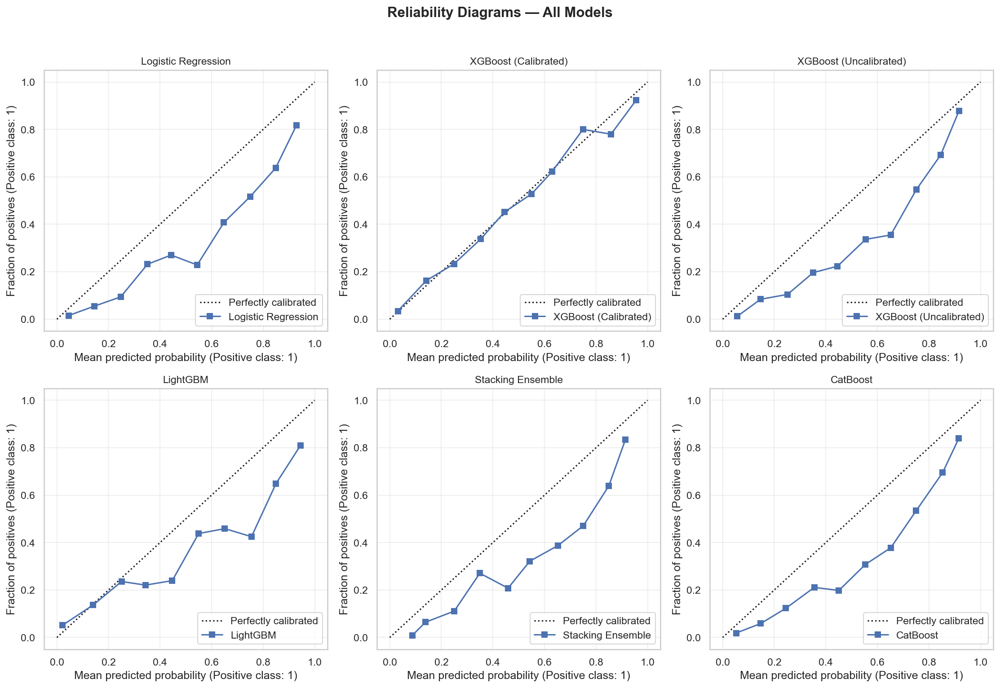

# 📉 Customer Churn Prediction using Cost-Sensitive Machine Learning


---

## 📌 Overview

This project is a **complete end-to-end Customer Churn Prediction system** designed to optimize **real-world business decisions**, not just model accuracy.

Unlike traditional ML projects, this system focuses on:

* 💰 Minimizing financial loss (₹)
* 🎯 Optimizing decision thresholds
* 🧠 Selecting models based on business impact

---

## 🚀 Why This Project Stands Out

Most ML projects optimize for accuracy.

👉 This project optimizes for **business cost**, making it **production-relevant and decision-focused**.

✔ Uses cost-sensitive learning
✔ Selects threshold based on financial impact
✔ Chooses model based on real-world loss
✔ Includes explainability + deployment pipeline

---

## 💰 Cost-Sensitive Learning (Core Innovation)

* False Negative (missed churner) → ₹10,000 loss
* False Positive (unnecessary offer) → ₹500 cost

👉 Model is optimized to **minimize total cost**, not maximize accuracy.

---

## 🎯 Threshold Optimization

Instead of default `0.5`, the project:

* Tests multiple thresholds
* Selects the **cost-optimal threshold on out-of-fold validation data only** — the test set is never used for tuning

📉 Result (deployed model, single evaluation on the held-out test set):

* Cost at default threshold 0.5: ₹1,025,500
* Cost at the locked threshold 0.07: ₹419,500
* 💸 Savings: **₹606,000 (59% cost reduction)**

> **A note on honesty:** earlier versions of this project tuned the threshold
> *on the test set* and reported ₹382,500–₹392,500. That number was leaked —
> the test set was used for model selection, threshold tuning, *and* the final
> report. The protocol was rebuilt (validation-only selection, one look at the
> test set) and the corrected figure is ₹419,500. A smaller number, but one
> that generalizes — finding and fixing this is part of the project story.

---

## 📊 Business Impact Visualization




---

## 🧠 Business-Driven Model Selection

Seven models compete (LR, Decision Tree, Random Forest, XGBoost, LightGBM,
CatBoost, Stacking) and the winner is picked by **lowest out-of-fold
validation cost**, not accuracy.

👉 Deployed model: **CatBoost** (validation cost ₹1,618,500, threshold 0.07)

The top models are statistically close — the notebook's McNemar/DeLong
significance tests show CatBoost, XGBoost and the stacking ensemble are within
noise of each other, and the research notebook's slightly different candidate
pool (it adds an Optuna-tuned LR and an early-stopped XGBoost variant) selects
XGBoost at an equivalent honest test cost (₹395,500). The deployed artifact is
always whatever wins the reproducible `python backend/train.py` run.

---

## ⚙️ Complete ML Pipeline

```
Data Loading → EDA → Cleaning → sklearn Pipeline (Feature Engineering +
Encoding + Model) → Out-of-Fold Validation (threshold + model selection) →
Single Test-Set Evaluation → Artifact Saving → Inference
```

The preprocessing and the model live in **one fitted `sklearn.Pipeline`**,
serialized as a single artifact — training and inference cannot encode a
customer differently by construction.

---

## 📊 Models Used

* Logistic Regression (Baseline + Tuned)
* Decision Tree
* Random Forest
* XGBoost (Calibrated with Isotonic Regression)
* LightGBM
* CatBoost
* Stacking Ensemble
* Artificial Neural Network (PyTorch)

---

## 📈 Evaluation Metrics

* Accuracy
* Precision / Recall / F1-score
* ROC-AUC & PR-AUC
* Confusion Matrix
* Cross-validation
* 💰 **Business Cost (Primary Metric)**

---

## 🔍 Explainability

* SHAP Global Feature Importance
* SHAP Individual Predictions

👉 Helps identify **key churn drivers**

---

## 🤖 Deep Learning (ANN)

* PyTorch-based neural network
* Dropout + BatchNorm
* Early stopping + checkpointing
* Class imbalance handled using weighted loss

---

## 📊 Final Results

Model comparison — **validation (out-of-fold) cost**, which is what selection
uses (per-model thresholds are also chosen on validation only):

| Model                | CV ROC-AUC | Validation Cost (₹) | Status     |
| -------------------- | ---------- | ------------------- | ---------- |
| CatBoost             | 0.8437     | **1,618,500**       | ✅ Selected |
| XGBoost (Calibrated) | 0.8434     | 1,642,000           | Runner-up  |
| LightGBM             | 0.8330     | 1,658,000           | Evaluated  |
| Stacking Ensemble    | 0.8490     | 1,662,000           | Evaluated  |
| Logistic Regression  | 0.8476     | 1,695,000           | Evaluated  |
| Random Forest        | 0.8395     | 1,727,000           | Evaluated  |
| Decision Tree        | 0.8215     | 1,944,500           | Evaluated  |

Final held-out test evaluation (performed **once**, after model + threshold
were locked): **test ROC-AUC 0.8408, test cost ₹419,500** vs ₹1,025,500 at the
default threshold.

The PyTorch ANN is trained in the notebook for reference (test ROC-AUC ~0.84)
but is **excluded from cost-based selection** — it has no out-of-fold
probabilities, so including it would not be an apples-to-apples comparison.

👉 Final Model: **CatBoost (cost-optimal on validation)**

---

## 📂 Project Structure

```
├── backend/                  # FastAPI app + training pipeline
│   ├── main.py               #   API endpoints (/run-pipeline, /predict, ...)
│   ├── pipeline.py            #   training, OOF validation, selection, SHAP
│   ├── features.py            #   THE single raw-row -> features code path
│   ├── predictor.py           #   single-customer inference over the artifact
│   ├── model_loader.py        #   artifact loading
│   ├── train.py               #   one-command reproduction (python train.py)
│   ├── schemas.py             #   pydantic request/response models
│   └── job_store.py           #   in-memory async job tracking
├── src/                       # React + TypeScript dashboard (Vite, shadcn/ui)
├── data/
│   └── telco_churn.csv
├── models/
│   └── churn_model.pkl        # single artifact: pipeline + threshold + metadata
├── notebooks/
│   └── Cuatomer_Churn_Model.ipynb   # research notebook (mirrors the pipeline)
├── tests/                     # pytest: encoding regression + API consistency
├── AUDIT.md                   # findings from the correctness audit
├── requirements.txt
└── README.md
```

---

## ⚙️ Installation & Setup

```bash
git clone https://github.com/your-username/churn-prediction.git
cd churn-prediction
python -m venv venv
```

Activate:

```bash
venv\Scripts\activate  # Windows
source venv/bin/activate  # Mac/Linux
```

Install dependencies:

```bash
pip install -r requirements.txt
```

---

## 🚀 Inference (Production-Ready)

```python
import pickle
import pandas as pd

with open("models/churn_model.pkl", "rb") as f:
    artifact = pickle.load(f)

pipeline = artifact["pipeline"]     # full sklearn Pipeline: raw rows in, probabilities out
threshold = artifact["threshold"]   # cost-optimal threshold (chosen on validation)
metadata = artifact["metadata"]     # model name, feature names, training date, git commit

# Raw customer rows — no manual encoding, the pipeline does everything
input_df = pd.DataFrame([{
    "gender": "Female", "SeniorCitizen": 0, "Partner": "Yes", "Dependents": "No",
    "tenure": 24, "PhoneService": "Yes", "MultipleLines": "Yes",
    "InternetService": "Fiber optic", "OnlineSecurity": "Yes", "OnlineBackup": "No",
    "DeviceProtection": "Yes", "TechSupport": "No", "StreamingTV": "Yes",
    "StreamingMovies": "No", "Contract": "One year", "PaperlessBilling": "Yes",
    "PaymentMethod": "Credit card (automatic)", "MonthlyCharges": 95.0,
    "TotalCharges": 2280.0,
}])

probs = pipeline.predict_proba(input_df)[:, 1]
predictions = (probs >= threshold).astype(int)
```

To retrain from scratch and regenerate the artifact:

```bash
cd backend
python train.py
```

---

## 🎯 Real-World Applications

* Telecom churn prediction
* SaaS & subscription retention
* Banking & insurance analytics
* E-commerce personalization

---

## 📌 Key Takeaways

✔ Accuracy alone is misleading
✔ Threshold tuning is critical — but only on validation data, never the test set
✔ Business cost should drive ML decisions
✔ An honest, smaller number beats an inflated, leaked one

---

## 👨‍💻 Author

**Pranav**

---

## ⭐ Final Thought

> Machine Learning is not about predicting correctly.
> It is about making the **right decision at the right cost**.
