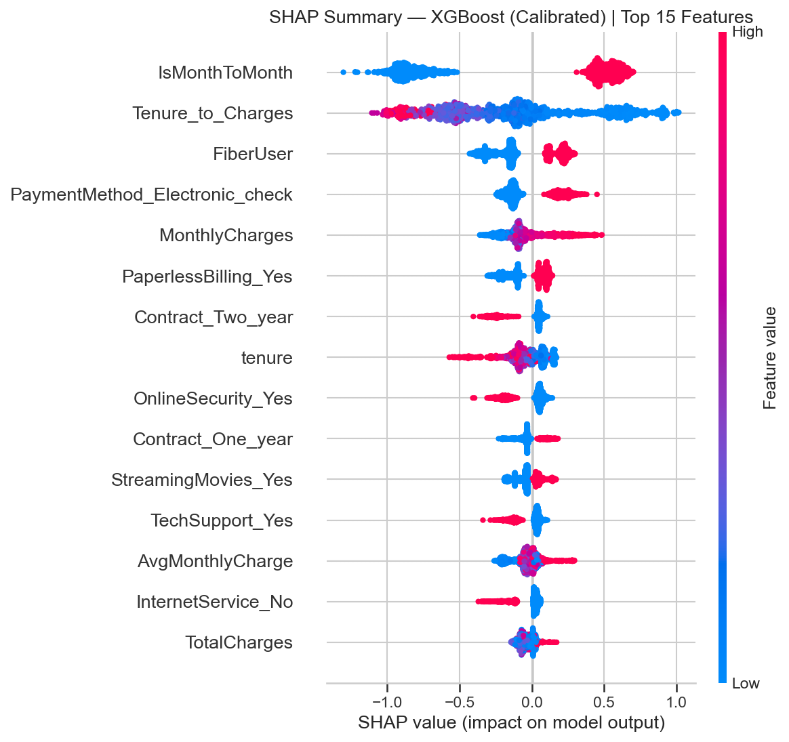
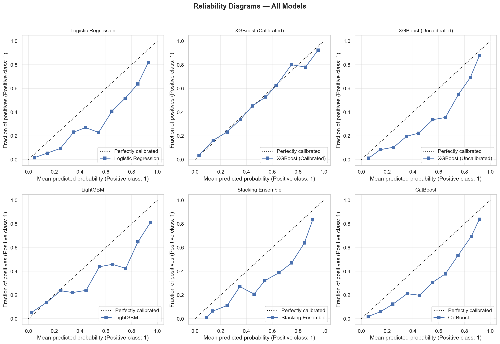

# 📉 Customer Churn Prediction using Cost-Sensitive Machine Learning


---

## 📌 Overview

This project is a **complete end-to-end Customer Churn Prediction system** designed to optimize **real-world business decisions**, not just model accuracy.

Unlike traditional ML projects, this system focuses on:

* 💰 Minimizing financial loss (in the dataset's own currency units)
* 🎯 Optimizing decision thresholds
* 🧠 Selecting models based on business impact

---

## 🚀 Why This Project Stands Out

Most ML projects optimize for accuracy.

👉 This project optimizes for **business cost**, making it **production-relevant and decision-focused**.

✔ Uses cost-sensitive learning
✔ Selects threshold based on financial impact
✔ Chooses model based on real-world loss
✔ Includes explainability + deployment pipeline

---

## 💰 Cost-Sensitive Learning (Core Innovation)

The FN/FP costs are **derived from the dataset**, not guessed. The old hardcoded
₹10,000 / ₹500 were arbitrary magic numbers; they are now computed with a
documented CLV formula (`derive_costs()` in `backend/churn_intel/costs.py`):

* **FN (missed churner)** = `avg_monthly_charges × retained_lifetime_months × gross_margin`
  — the margin on the revenue a churner would have produced over a typical
  retained customer's lifetime. On the Telco data: `64.76 × 37.57 × 0.30 ≈ 730`.
* **FP (wasted retention offer)** = `retention_discount × avg_monthly_charges × offer_duration_months`
  — the incentive spent on a non-churner. On the Telco data: `0.20 × 64.76 × 3 ≈ 39`.

Documented assumptions (challengeable, in one place): gross margin 30%, retention
offer = 20% off for 3 months. A user can still override both costs live; the
derived values are only the default.

👉 Model is optimized to **minimize total cost**, not maximize accuracy.

### Cost-ratio sensitivity — the optimum is not a fixed point

The dashboard's **Cost-Ratio Sensitivity** chart (`GET /cost-sensitivity`) sweeps
the FN/FP ratio and shows the cost-optimal threshold move accordingly — computed
from the same out-of-fold predictions via the real cost curve. On the demo run
the optimal threshold falls from **0.67** (ratio 1:1) to **0.02** (ratio 100:1)
as missing a churner gets more expensive, with recall rising 0.39 → 0.99. A single
fixed threshold (or cost) is a red flag: the right operating point depends on the
ratio.

---

## 🎯 Threshold Optimization

Instead of default `0.5`, the project:

* Tests multiple thresholds
* Selects the **cost-optimal threshold on out-of-fold validation data only** — the test set is never used for tuning

📉 Result (deployed model, single evaluation on the held-out test set):

* Cost at default threshold 0.5: 75,439 cost units
* Cost at the locked threshold 0.07: 32,321 cost units
* 💸 Savings: **43,118 (57% cost reduction)**

Cost units are the dataset's own currency at the derived FN 730 / FP 39 costs above (not
rupees). Earlier revisions of this README priced the same test results at the old fixed
10,000 / 500 costs, which is why their figures were much larger.

> **A note on honesty:** earlier versions of this project tuned the threshold
> *on the test set* and reported a test cost 6–9% lower than the honest one (at the
> old fixed 10,000 / 500 costs: 382,500–392,500 against 419,500). That number was
> leaked — the test set was used for model selection, threshold tuning, *and* the final
> report. The protocol was rebuilt (validation-only selection, one look at the
> test set). A worse-looking number, but one that generalizes — finding and fixing
> this is part of the project story.

### Interactive cost curve (dashboard)

The dashboard's **Cost vs Threshold** chart (Threshold Optimization and Business
Analysis pages) is computed by the backend, not the browser. For the selected
model, the backend evaluates an **exact confusion matrix at 99 thresholds** over
its **out-of-fold validation predictions** and returns the curve
(`GET /threshold-curve?cost_fn=&cost_fp=`). The FN/FP cost inputs on the Settings
page are sent with that request, so changing them recomputes the curve
server-side — no retraining, and nothing about the curve is synthesised on the
client.

> An earlier version of the dashboard faked this chart: it extrapolated the whole
> curve from a single confusion matrix with a sigmoid/exponential ramp, and the
> cost inputs never left the browser. That is fixed; regression tests
> (`tests/test_threshold_curve*.py`, `src/hooks/useThresholdCurve.test.tsx`)
> assert every plotted point equals a direct confusion-matrix cost and that the
> curve moves when the costs change.

> **"Cost" in the model-comparison table is validation cost.** The per-model
> cost shown on the Model Comparison page is the **out-of-fold (validation)**
> business cost — the exact quantity model selection minimises. It is *not* a
> test-set number; the held-out test set is scored once, in the final summary.

---

## 📊 Business Impact Visualization




---

## 🧠 Business-Driven Model Selection

Seven models compete (LR, Decision Tree, Random Forest, XGBoost, LightGBM,
CatBoost, Stacking) and the winner is picked by **lowest out-of-fold
validation cost**, not accuracy.

👉 Deployed model: **CatBoost** (validation cost 125,093, threshold 0.07)

The top models are statistically close — the notebook's McNemar/DeLong
significance tests show CatBoost, XGBoost and the stacking ensemble are within
noise of each other, and the research notebook's slightly different candidate
pool (it adds an Optuna-tuned LR and an early-stopped XGBoost variant) selects
XGBoost at an equivalent honest test cost (395,500 at the old fixed 10,000 / 500 costs). The deployed artifact is
always whatever wins the reproducible `python backend/train.py` run.

---

## ⚙️ Complete ML Pipeline

```
Data Loading → EDA → Cleaning → sklearn Pipeline (Feature Engineering +
Encoding + Model) → Out-of-Fold Validation (threshold + model selection) →
Single Test-Set Evaluation → Artifact Saving → Inference
```

The preprocessing and the model live in **one fitted `sklearn.Pipeline`**,
serialized as a single artifact — training and inference cannot encode a
customer differently by construction.

---

## 📊 Models Used

* Logistic Regression (Baseline + Tuned)
* Decision Tree
* Random Forest
* XGBoost (Calibrated with Isotonic Regression)
* LightGBM
* CatBoost
* Stacking Ensemble
* Artificial Neural Network (PyTorch)

---

## 📈 Evaluation Metrics

* Accuracy
* Precision / Recall / F1-score
* ROC-AUC & PR-AUC
* Confusion Matrix
* Cross-validation
* 💰 **Business Cost (Primary Metric)**

---

## 🔍 Explainability

* SHAP Global Feature Importance
* SHAP Individual Predictions

👉 Helps identify **key churn drivers**

---

## 🤖 Deep Learning (ANN)

* PyTorch-based neural network
* Dropout + BatchNorm
* Early stopping + checkpointing
* Class imbalance handled using weighted loss

---

## 📊 Final Results

Model comparison — **validation (out-of-fold) cost**, which is what selection
uses (per-model thresholds are also chosen on validation only):

| Model                | CV ROC-AUC | Validation Cost (cost units) | Status     |
| -------------------- | ---------- | ---------------------------- | ---------- |
| CatBoost             | 0.8437     | **125,093**                  | ✅ Selected |
| XGBoost (Calibrated) | 0.8434     | 126,876                      | Runner-up  |
| LightGBM             | 0.8330     | 128,274                      | Evaluated  |
| Stacking Ensemble    | 0.8490     | 128,836                      | Evaluated  |
| Logistic Regression  | 0.8476     | 130,438                      | Evaluated  |
| Random Forest        | 0.8395     | 133,056                      | Evaluated  |
| Decision Tree        | 0.8215     | 148,321                      | Evaluated  |

The cost gaps at the top are small (CatBoost leads XGBoost by 1.4%) and the
five-fold CV ROC-AUC spread is about ±0.01, so the ranking of the leading models is
not statistically settled.

Final held-out test evaluation (performed **once**, after model + threshold
were locked): **test ROC-AUC 0.8408, test cost 32,321** vs 75,439 at the
default threshold.

The PyTorch ANN is trained in the notebook for reference (test ROC-AUC ~0.84)
but is **excluded from cost-based selection** — it has no out-of-fold
probabilities, so including it would not be an apples-to-apples comparison.

👉 Final Model: **CatBoost (cost-optimal on validation)**

---

## 📂 Project Structure

```
├── backend/                  # FastAPI app + training pipeline
│   ├── main.py               #   API endpoints (/run-pipeline, /predict, ...)
│   ├── pipeline.py            #   training, OOF validation, selection, SHAP
│   ├── features.py            #   THE single raw-row -> features code path
│   ├── predictor.py           #   single-customer inference over the artifact
│   ├── model_loader.py        #   artifact loading
│   ├── train.py               #   one-command reproduction (python train.py)
│   ├── schemas.py             #   pydantic request/response models
│   └── job_store.py           #   in-memory async job tracking
├── src/                       # React + TypeScript dashboard (Vite, shadcn/ui)
├── data/
│   └── telco_churn.csv
├── models/
│   └── churn_model.pkl        # single artifact: pipeline + threshold + metadata
├── notebooks/
│   └── Cuatomer_Churn_Model.ipynb   # exploratory/research only — not run in
│                                    #   production, not kept in lockstep with
│                                    #   backend/churn_intel/ (see its own first
│                                    #   cell, and DEPLOYMENT.md)
├── tests/                     # pytest: encoding regression + API consistency
├── AUDIT.md                   # findings from the correctness audit
├── requirements.txt
└── README.md
```

---

## 🏗️ Architecture

**FastAPI backend** (`backend/`, package `churn_intel`) does data cleaning,
feature engineering, model training/selection, cost curves, and inference
behind a REST API. **React/Vite/shadcn dashboard** (`src/`) talks to it over
HTTP. **Jupyter notebook** (`notebooks/`) is exploratory research only — see
the note in its first cell and `DEPLOYMENT.md`.

The backend serializes one artifact (`models/churn_model.pkl`): the fitted
sklearn `Pipeline` + chosen threshold + metadata (model name, feature names,
training date, git commit). Inference always goes through that same
pipeline, so training and serving cannot encode a customer differently by
construction (Phase 1).

## 🚀 Running and deploying

- **Docker (recommended)** — see `DEPLOYMENT.md` for `docker compose up`,
  individual image builds, the single-worker constraint, API-key auth, and
  observability (`/health` fields, request logging) added in Phase 6.
- **Local dev** — see `HANDOFF.md` §1 for the exact venv Python path, test
  commands, and how to run the API/frontend dev servers directly.

## ⚙️ Installation & Setup

```bash
git clone https://github.com/your-username/churn-prediction.git
cd churn-prediction
python -m venv venv
```

Activate:

```bash
venv\Scripts\activate  # Windows
source venv/bin/activate  # Mac/Linux
```

Install dependencies:

```bash
pip install -r requirements.txt
```

---

## 🚀 Inference (Production-Ready)

```python
import pickle
import pandas as pd

with open("models/churn_model.pkl", "rb") as f:
    artifact = pickle.load(f)

pipeline = artifact["pipeline"]     # full sklearn Pipeline: raw rows in, probabilities out
threshold = artifact["threshold"]   # cost-optimal threshold (chosen on validation)
metadata = artifact["metadata"]     # model name, feature names, training date, git commit

# Raw customer rows — no manual encoding, the pipeline does everything
input_df = pd.DataFrame([{
    "gender": "Female", "SeniorCitizen": 0, "Partner": "Yes", "Dependents": "No",
    "tenure": 24, "PhoneService": "Yes", "MultipleLines": "Yes",
    "InternetService": "Fiber optic", "OnlineSecurity": "Yes", "OnlineBackup": "No",
    "DeviceProtection": "Yes", "TechSupport": "No", "StreamingTV": "Yes",
    "StreamingMovies": "No", "Contract": "One year", "PaperlessBilling": "Yes",
    "PaymentMethod": "Credit card (automatic)", "MonthlyCharges": 95.0,
    "TotalCharges": 2280.0,
}])

probs = pipeline.predict_proba(input_df)[:, 1]
predictions = (probs >= threshold).astype(int)
```

To retrain from scratch and regenerate the artifact:

```bash
cd backend
python train.py
```

---

## 🎯 Real-World Applications

* Telecom churn prediction
* SaaS & subscription retention
* Banking & insurance analytics
* E-commerce personalization

---

## 📌 Key Takeaways

✔ Accuracy alone is misleading
✔ Threshold tuning is critical — but only on validation data, never the test set
✔ Business cost should drive ML decisions
✔ An honest, smaller number beats an inflated, leaked one

---

## 👨‍💻 Author

**Pranav**

---

## ⭐ Final Thought

> Machine Learning is not about predicting correctly.
> It is about making the **right decision at the right cost**.
